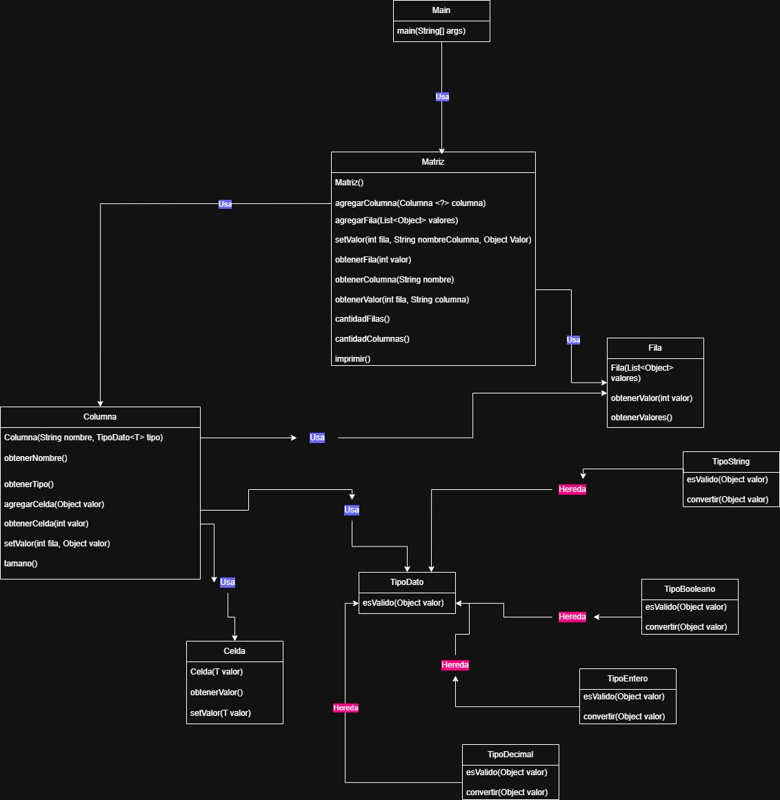

# TP Java
## Algoritmos 1 - 2026 1er Cuatrimestre 
### Objetivo
El objetivo de este trabajo práctico es que los estudiantes diseñen e implementen un sistema en Java aplicando los conceptos fundamentales de programación orientada a objetos.

Se espera que el desarrollo del sistema contemple:

* Abstracción y modelado de objetos.
* Encapsulamiento.
* Composición y relaciones entre clases.
* Uso adecuado de herencia y/o polimorfismo cuando sea necesario.
* Responsabilidad única de las clases.
* Buenas prácticas de diseño y legibilidad del código.

Asimismo, el desarrollo deberá realizarse teniendo en cuenta los principios de diseño orientado a objetos y buenas prácticas, guiándose por los principios SOLID en la medida en que resulten aplicables al problema planteado.

Además del desarrollo del sistema, los estudiantes deberán elaborar un diagrama de clases que represente el diseño realizado y justificar las decisiones tomadas respecto al uso de principios de diseño.

### Contexto del problema

Las bibliotecas de análisis de datos permiten trabajar con estructuras tabulares conocidas como Matrices (similares a un DataFrame de pandas), donde la información se organiza en filas y columnas.

Una Matriz puede contener diferentes tipos de datos y permite realizar operaciones de consulta, manipulación y transformación de la información.

El objetivo del trabajo será desarrollar una versión simplificada de este concepto, implementando un sistema propio en Java que permita representar y manipular datos tabulares.

No se espera replicar el comportamiento completo de bibliotecas profesionales, sino construir una solución orientada a objetos que modele correctamente el dominio.

### Requerimientos funcionales

El sistema deberá permitir, como mínimo:

**1. Creación de una Matriz**

El usuario debe poder crear una Matriz vacío.

**2. Gestión de columnas**

El sistema deberá permitir:

* Agregar columnas a la Matriz.
* Asignar un nombre a cada columna.
* Definir el tipo de dato admitido por cada columna.

    Tipos de datos posibles:
    - Texto (String)
    - Número entero (Integer)
    - Número decimal (Double)
    - Booleano (Boolean)
    
    Una columna podrá almacenar datos de un único tipo. 
    El diseño deberá contemplar la posibilidad de incorporar nuevos tipos de datos sin requerir modificaciones extensivas sobre el código existente.

El sistema deberá garantizar que los valores almacenados respeten el tipo definido para la columna.

**3. Gestión de filas**

El sistema deberá permitir:

* Agregar filas completas a la Matriz.
* Validar consistencia de datos (cantidad de valores y tipos compatibles).

**4. Modificación de datos**

El sistema deberá permitir:

* Modificar el valor de una celda

**5. Consulta de datos**

El sistema deberá permitir:

* Obtener una fila por índice.
* Obtener una columna por nombre.
* Obtener un valor específico indicando fila y columna.
* Consultar cantidad de filas y columnas.

**6. Visualización**

La Matriz deberá poder representarse de forma legible por consola.

**7. Consistencia de datos**

El sistema deberá impedir:

* Agregar filas con una cantidad inválida de valores.
* Agregar valores incompatibles con el tipo de una columna.
* Modificar celdas con datos inválidos.

### Requerimientos técnicos

El trabajo deberá cumplir con las siguientes condiciones:

* Estar implementado en Java.
* Aplicar principios de programación orientada a objetos.
* Evitar código duplicado.
* Mantener un diseño modular y extensible.
* Utilizar colecciones de Java cuando sea necesario.
* Validar errores y casos inválidos mediante excepciones o mecanismos apropiados.
* No utilizar bibliotecas externas (se deberá consultar a los docentes su uso en caso de ser necesario)

### Restricciones
* No se permite almacenar todos los datos en estructuras primitivas sin modelado orientado a objetos (por ejemplo, resolver todo únicamente con ArrayList<ArrayList<Object>> sin clases de dominio).
* Las responsabilidades deben estar correctamente separadas.
* Se deberá justificar el uso (o no uso) de herencia y polimorfismo.
* El diseño debe facilitar futuras extensiones del sistema.

### Entregables
La entrega deberá incluir:

**1. Código fuente**
    
    Proyecto Java completo.
    Código compilable y ejecutable.
    Ejemplos de uso del sistema mediante un main.

**2. Diagrama de clases**

Se debe agregar en el readme del repositorio.

**3. Documento de justificación**

En el readme del repositorio se debe documentar brevemente lo siguiente:

* Decisiones de diseño tomadas.
* Principios SOLID aplicados y ejemplos concretos.
* Responsabilidades de las principales clases.
* Dificultades encontradas y cómo fueron resueltas.

**4. Casos de prueba**

Se deberán incluir ejemplos de ejecución en el main que demuestren:

* Creación de Matrices.
* Agregado de columnas y filas.
* Modificación de celdas.
* Consulta de datos.
 

**2. Diagrama de clases**

**3. Documento de justificación**

### Decisiones de diseño tomadas:
Opté por una separación de clases y responsabilidades para aclarar más el código y hacerlo más legible.
Definí clases como Matriz, Columna o TipoDeDato que permiten una estructuración prolija, evitando estructuras genéricas. Como List<List<Object>>
Utilicé genéricos <T> en las columnas y celdas para mantener consistencia de tipos a la hora de ejecutar
### Justificación SOLID:

#### S (Single Responsibility):
Columna valida tipos
Matriz gestiona estructuras

#### O (Open/Closed):
Si se necesitás nuevos tipos se puede agregar otra clase TipoDato

#### L (Liskov):
Todas las implementaciones de TipoDato funcionan igual

#### I (Interface Segregation):
El trabajo tiene una interfaz simple y prolija

#### D (Dependency Inversion):
Columna depende de TipoDato, no de clases concretas

### Responsabilidades de las principales clases.
* Matriz
Su responsabilidad principal es gestionar la estructura general del sistema. También permite agregar columnas y filas y tiene métodos de consulta (filas, columnas, valores).
* Columna
Redundantemente, representa una columna con nombre y tipo. Valida que los valores sean compatibles con su tipo y almacena las celdas correspondientes a esa columna.
* Celda
Representa un valor dentro de la matriz.
* TipoDato
Define como validar y convertir valores.
### Dificultades encontradas y cómo fueron resueltas
* La Matriz contenía columnas de distintos tipos(string, int, etc), lo que complicó el uso de genéricos directamente. Por lo que utilicé Columna<?> en la matriz, para manejar diferentes tipos de columnas
* Otro problema fue lograr que cada fila tenga la cantidad correcta de valores y tipos compatibles.
Mi solución fue centralizar la clase Matriz, que verifica la cantidad de valores, y luego delegar en cada Columna la validación de tipos.